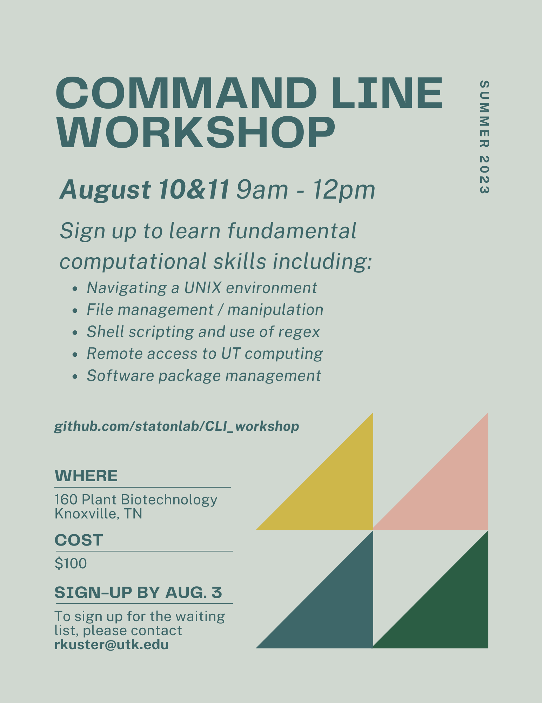

# CLI_workshop

Welcome to the 2023 Command Line Workshop! This workshop is being offered to all UTK students, staff, and faculty as an introductory, two day dive into using command line with confidence.

Interested? Contact rkuster@utk.edu.

*This workshop is contingent on enrollment, so please don't hesitate to request a spot!*

For course content, please see the [wiki](https://github.com/statonlab/CLI_workshop/wiki).

